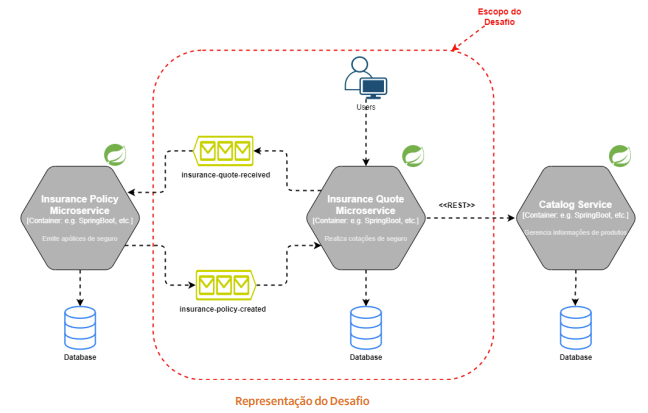

# Cotação Seguros API

Uma API REST para cotação de seguros, desenvolvida em Spring Boot com o objetivo de resolver o desafio da imagem abaixo:
 

Além de resolver o desafio da imagem, também é necessário realizar testes unitários, testes de integração e monitoramento.

## Tecnologias
* **Backend:** Java 17, Spring Boot, Spring Data JPA
* **Banco de dados:** H2 (em memória)
* **Mensageria:** Apache Kafka
* **Monitoramento:** Grafana, Loki, Prometheus
* **Testes:** JUnit 5, Mock Server
* **Gerenciamento de dependências:** Maven
* **Containerização:** Docker

## Arquitetura
A aplicação utiliza uma arquitetura MVC e segue o seguinte fluxo:
* **Requisição:** O cliente envia uma requisição HTTP para a API.
* **Validação:** A API valida os dados da requisição.
* **Kafka:** Dados válidos são enviados para um tópico Kafka para processamento assíncrono.
* **Processamento:** Kafka processa a mensagem e gera um ID único.
* **Resposta:** A API retorna o ID único para consulta posterior.
* **Monitoramento:** Grafana, Loki e Prometheus monitoram o sistema em tempo real.

## Container e serviços:
* **API da Aplicação:** http://localhost:4321 ou http://ctn-cotacao-seguros-api:4321
* **API do Catálogo (Mock):** http://localhost:4322 ou http://ctn-cotacao-seguros-api:4322
* **Loki:** http://localhost:3100 ou http://ctn-loki:3100
* **Prometheus:** http://localhost:9090 ou http://ctn-prometheus:9090
* **Grafana:** http://localhost:3000 ou http://ctn-grafana:3000

## Pré-requisitos
Para conseguir executar o projeto, garanta que tenha instalado os recursos abaixo:
* **Java 17:** Instalar o JDK 17.
* **Maven:** Instalar o Apache Maven.
* **Docker:** Instalar o Docker.
* **Docker Compose:** Instalar o Docker Compose.

## Para executar:
* Baixe o projeto
* Acesse a pasta raíz do projeto
* Execute: mvn clean install
* Execute: docker compose up --build

## Para visualizar logs no Grafana:
### 1. Acessar a URL http://localhost:3100

### 2. Data Source do Prometheus
* 2.1. Acessar o menu lateral esquerdo > engrenagem > data sources
* 2.2. Adicionar data source do Prometheus
* 2.3. Na URL utilizar http://ctn-prometheus:9090
* 2.4. clicar em Save & Test

### 3. Data Source do Loki
* 3.1. Acessar o menu lateral esquerdo > engrenagem > data sources
* 3.2. Adicionar data source do Loki
* 3.3. Na URL utilizar http://ctn-loki:3100
* 3.4. clicar em Save & Test

### 4. Painel do Prometheus
* 4.1. Acessar o menu lateral esquerdo > simbolo de mais > import
* 4.2. Preencher com o ID 1860
* 4.3. Clicar em Load
* 4.4. Selecionar o data source do prometheus
* 4.5. Clicar em Import

### 5. Painel do Loki
* 5.1. Acessar o menu lateral esquerdo > bussola
* 5.2. Selecionar o datasource do Loki
* 5.3. No Log browser, filtrar por {app="projeto-cotacao-seguros-api"}
* 5.4. Run Query